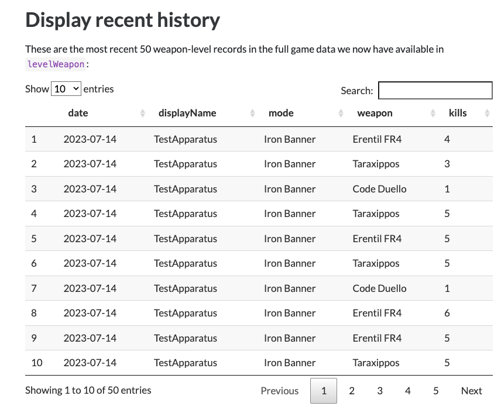
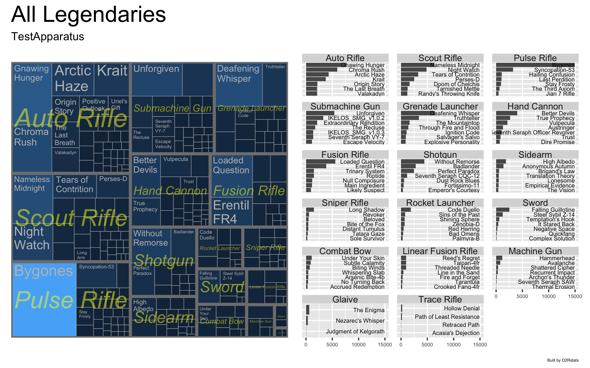
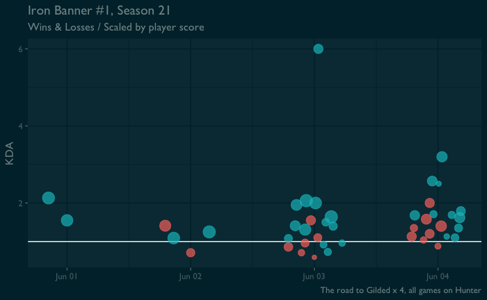

# D2Rstats

D2Rstats are a set of R tools in the form of some [Quarto](https://quarto.org) notebooks, to download and process Destiny 2 postgame carnage reports (PGCRs). It consists of three notebooks:

1.  `getpgcrs.qmd` : Downloads a user's complete PGCR history and saves the game history.
2.  `manifest.qmd`: Manage a local copy of the Destiny 2 manifest for use in stats generation
3.  `processpgcrs.qmd` : Builds a data set and several output summaries and visualizations.

## Output examples

Running `processpgcrs.qmd` builds an html file containing recent history and some sample visualizations.







## Requirements

-   You'll need an API key from the Destiny 2 API, available by [creating an application here](https://www.bungie.net/en/Application).
-   An R environment with needed libraries installed
-   [Quarto](https://quarto.org) installed

If you're not familiar with R and Quarto, I recommend using RStudio, as it will prompt you to install needed libraries. There are also good Quarto modes for Emacs and VSCode.

## Setup

Copy the `parameters-blank.R` file to `parameters.R` and complete it with the following information. At minimum you need to fill in:

```         
membershipId <- "YOUR_ID"
membershipType <- 1
API_KEY <- "YOUR_API_KEY"
filterName <- "Your Gamer Tag"
# filterName is your displayed name in-Game,
#   not your Bungie ID
```

The easiest way to get your membership ID (if you don't already have it handy from screwing around with the Bungie API), is to view the URL of your profile page at bungie.net: `https://www.bungie.net/7/en/User/Profile/[TYPE]/[MEMBERSHIP_ID]?bgn=[displayName].`

The blank parameters file contains a reference for membership types, and this value can also be found in that profile URL in the `[TYPE]` part of the URL. Xbox is type `1` for example.

## Usage

There are three ways to execute quarto documents using RStudio: Step through and execute chunk by chunk; via the "Run All" menu button; and by using the "Render" menu option. **Render** will execute the entire document and generate an html output file. (Okay, four options: you can also `quarto render filename.qmd` at a shell for the same output.)

1.  Run `getpgcrs.qmd`: This notebook can be executed in its entirety to fetch and store a folder of PGCR json files.

    -   This will create a new data folder labeled with your membership ID, which contains all downloaded PGCR files. See the introduction to that notebook for more detail about what it does.

2.  Run `manifest.qmd`: Destiny 2 has a manifest file provided by the API that contains activity and item information. This notebook prepares a local sqlite version of the manifest with a simplified set of information for easy usage by D2Rstats or other tools.

    -   If no local manifest exists yet, or if the remote manifest is newer than your local copy, `manifest.qmd` will fetch and (re)build the locally-stored version. You don't need to run this notebook every time, but if the manifest is out of date you may find the stats output incomplete (this also occasionally happens when you have information in game or equipment history that Bungie has labeled as **classified**. In that case, there's nothing to do but wait for the manifest to un-classify it.

3.  Run `processpgcrs.qmd`: This does the work of building your output. Rendering it will produce a file called `processpgcrs.html` that contains several listings and visualizations. 

The image files generated by this notebook will be written to an output folder prefixed with the membership ID being processed. 

Rendering the entire notebook for my 10000+ sample activity data set takes about 2 minutes.

    This notebook also contains several example code chunks that produce additional output. These are marked with the `#| eval: false` option header so that they won't automatically be run when the full notebook is executed, and are meant to be illustrations for building your own further output, such as Iron Banner summaries or other mode-specific visualizations.

## 
